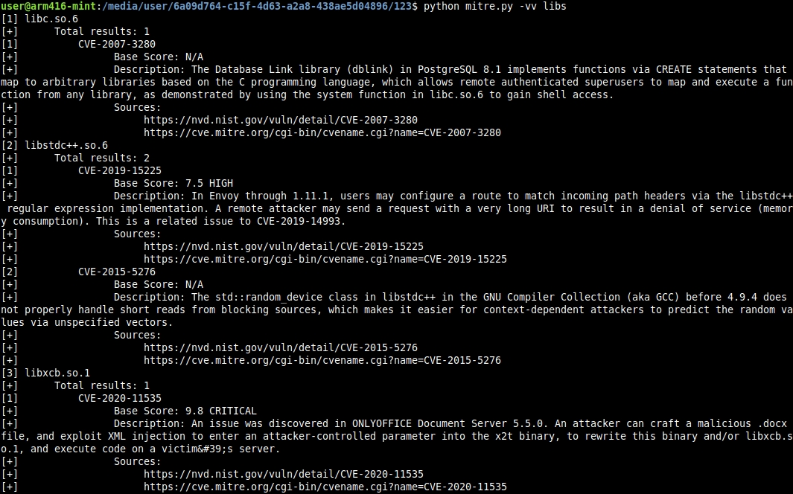

# Поиск уязвимостей из открытых источников
Поиск уязвимостей исходя из ключевых слов, названия библиотек, протокола, типа и т.д.
Поиск происходит через сайты  
https://cve.mitre.org/  
https://nvd.nist.gov/  
Пример выполнения команды:  
  
